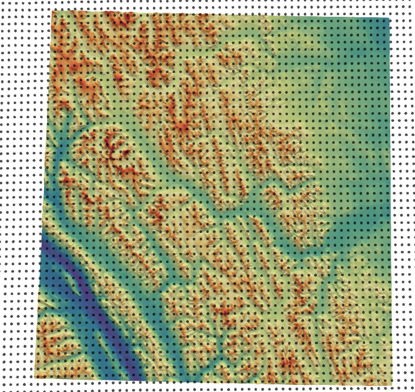

Forcing
========

ASCII timeseries
*****************

.. warning::
    If using ground-based observations for incoming shortwave radiation, please look at the ``already_cosine_corrected`` for the module ``iswr``.

Forcing data are defined as a delineated format. Datetime format is ISO standard as

   ``[year][month][day]T[hour][minute][second]``

Column order does not matter.

::

   datetime       Qsi      Qli    g    t       rh      u       vw_dir  p
   20001001T000000 -0.237  276 -2.436  -10.98  95.7    2.599   308.2   0.0
   20001001T003000 -0.233  278 -2.42   -11.19  95.7    3.133   307.1   0.0

where the input variable names correspond to the variable names the selected modules expect. Please refer to those modules' documentation.

Some restrictions:
        - No more than 2147483647 steps. At 1s intervals, this equates to roughly 68 years.
        - Consistent units. You mustn't have mm on one line, then meters on the next, for the same observation
        - Constant time stepping. The first interval is taken as the interval for the rest of the file
        - Missing values are not currently allowed - that is, each row must be complete with n entries where n is number of variables.
        - All forcing files have the same start and end dates. Can be filled with missing values.
        - However, a missing value value (i.e., -9999) can be used to represent missing data
        - Whitespace, tab or comma delimited. Allows for mixed usage. ex 1234, 4543 890 is legal
        - Values must be numeric

Integer styles:
      -   +1234
      -   -1234
      -   1234567890

Floating point:
      -   12.34
      -   12.
      -   .34
      -   12.345
      -   1234.45
      -   +12.34
      -   -12.34
      -   +1234.567e-89
      -   -1234.567e89

Time:
        - Must be in one column in the following ISO 8601 date time form:
        - YYYYMMDDThhmmss   e.g., 20080131T235959

This format is easily parseable with Pandas in Python

.. code:: python

   obs = pd.read_csv("uc_2005_2014.txt",sep="\t",parse_dates=[0])
   obs.set_index('datetime',inplace=True)
   obs.index = pd.to_datetime(obs.index)

Various conversion scripts for other models’ input/output are located in the ``tools`` directory.

NetCDF
********

The use NetCDF as input creates virtual stations at the cell-centres. The NetCDF file is lazy loaded as required for each triangle, so only the values required are loaded.
The variable names, like for ASCII inputs, needs to correspond to the values expected by the filters.

An example of this is shown below, where each black point is a virtual station, representing the center for a NetCDF grid cell from a NWP product.

.. warning::
   
   NetCDF and ``point_mode`` are not supported.

Grid
~~~~~~

- the nc file is a regular grid of x,y values
- WGS84 lat/long
- consistent grid between model timesteps
- The underlying grid is specified in coordinates: ``ygrid_0`` and ``xgrid_0``
- The lat/long is specified in variables ``gridlat_0`` and ``gridlon_0``
- The elevation of the observation is given in ``HGT_P0_L1_GST`` (m)

Timesteps
~~~~~~~~~~

- at least two timesteps
- named ``datetime``
- time is in UTC+0
- the difference between these is used to determine model dt
- timesteps are offsets from an epoch (format ``YYYY-mm-dd HH:MM:SS`` or ``YYYY-mm-ddTHH:MM:SS``)
- units are hours, minutes, seconds
- This is specified as the units: ``datetime:units = "hours since 2017-09-01 06:00:00" ;``
- offset are given as ``int64``

Schema
~~~~~~~

In detail the following is the schema for the required NetCDF files:

.. code:: 

   dimensions:
      datetime = UNLIMITED ; 
      ygrid_0 = int ;
      xgrid_0 = int ;

   variables:
      double VAR_NAME(datetime, ygrid_0, xgrid_0) ;
         VAR_NAME:_FillValue = NaN ;
         VAR_NAME:coordinates = "gridlat_0 gridlon_0" ;

      double HGT_P0_L1_GST(datetime, ygrid_0, xgrid_0) ;
         HGT_P0_L1_GST:_FillValue = NaN ;
         HGT_P0_L1_GST:coordinates = "gridlat_0 gridlon_0" ;

      int64 datetime(datetime) ;
         datetime:standard_name = "time" ;
         datetime:long_name = "Validity time" ;
         datetime:axis = "T" ;
         datetime:units = "hours since 2017-09-01 06:00:00" ;
         datetime:calendar = "proleptic_gregorian" ;

      double gridlat_0(ygrid_0, xgrid_0) ;
         gridlat_0:_FillValue = NaN ;
         gridlat_0:long_name = "latitude" ;
         gridlat_0:standard_name = "latitude" ;
         gridlat_0:units = "degrees_north" ;

      double gridlon_0(ygrid_0, xgrid_0) ;
         gridlon_0:_FillValue = NaN ;
         gridlon_0:long_name = "longitude" ;
         gridlon_0:standard_name = "longitude" ;
         gridlon_0:units = "degrees_east" ;

      double xgrid_0(xgrid_0) ;
         xgrid_0:_FillValue = NaN ;
         xgrid_0:long_name = "longitude ;
         xgrid_0:standard_name = "longitude" ;
         xgrid_0:units = "degrees" ;
         xgrid_0:axis = "X" ;

      double ygrid_0(ygrid_0) ;
         ygrid_0:_FillValue = NaN ;
         ygrid_0:long_name = "latitude" ;
         ygrid_0:standard_name = "latitude" ;
         ygrid_0:units = "degrees" ;
         ygrid_0:axis = "Y" ;