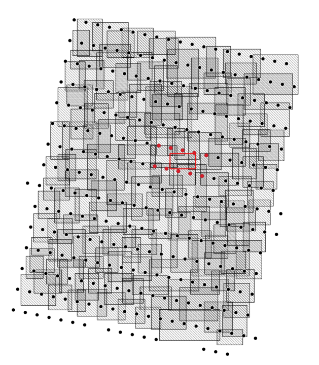

Forcing
========

ASCII timeseries
*****************

.. warning::
    If using ground-based observations for incoming shortwave radiation, please look at the ``already_cosine_corrected`` for the module ``iswr``.

Forcing data are defined as a delineated format. Datetime format is ISO standard as

   ``[year][month][day]T[hour][minute][second]``

Column order does not matter.

::

   datetime       Qsi      Qli    g    t       rh      u       vw_dir  p
   20001001T000000 -0.237  276 -2.436  -10.98  95.7    2.599   308.2   0.0
   20001001T003000 -0.233  278 -2.42   -11.19  95.7    3.133   307.1   0.0

where the input variable names correspond to the variable names the selected modules expect. Please refer to those modules' documentation.

Some restrictions:
        - No more than 2147483647 steps. At 1s intervals, this equates to roughly 68 years.
        - Consistent units. You mustn't have mm on one line, then meters on the next, for the same observation
        - Constant time stepping. The first interval is taken as the interval for the rest of the file
        - Missing values are not currently allowed - that is, each row must be complete with n entries where n is number of variables.
        - All forcing files have the same start and end dates. Can be filled with missing values.
        - However, a missing value value (i.e., -9999) can be used to represent missing data
        - Whitespace, tab or comma delimited. Allows for mixed usage. ex 1234, 4543 890 is legal
        - Values must be numeric

Integer styles:
      -   +1234
      -   -1234
      -   1234567890

Floating point:
      -   12.34
      -   12.
      -   .34
      -   12.345
      -   1234.45
      -   +12.34
      -   -12.34
      -   +1234.567e-89
      -   -1234.567e89

Time:
        - Must be in one column in the following ISO 8601 date time form:
        - YYYYMMDDThhmmss   e.g., 20080131T235959

This format is easily parseable with Pandas in Python

.. code:: python

   obs = pd.read_csv("uc_2005_2014.txt",sep="\t",parse_dates=[0])
   obs.set_index('datetime',inplace=True)
   obs.index = pd.to_datetime(obs.index)

If you have dates in a different format:

.. code:: python

   obs = pd.read_csv('rosthern_met.csv',parse_dates=[1])
   obs.to_csv("file.txt", sep='\t', index_label='datetime', date_format='%Y%m%dT%H%M%S', na_rep='-9999',index=False)

Various conversion scripts for other models’ input/output are located in the ``tools`` directory.

NetCDF
********

When using a NetCDF file as input, CHM creates virtual stations at the cell-centres. Only the stations that are
required by the mesh subset are loaded as specified by the ``option:station_N_nearest``. With multiple MPI ranks,
only the stations required for the current ranks' mesh subset are loaded. This is shown in the figure below where
each black dot is a cell-centre virtual station location, and the gray squares are each MPI ranks bounding box. In
red is some arbitrary rank's bounding box with the cell centres used. Note that non of the forcing cell centres falls
within the meshes' domain. An iterative increasing 25% search radius is used until ``option:station_N_nearest`` are
found or 250% expansion is reached with no stations found.

All timesteps are lazy loaded as required. This ensures the memory foot print is low.
The internal CHM variable names are mapped from CF compliant ``standard_name`` variable
attributes. If a variable doesn't have a ``standard_name`` or is not in this table, it is ignored and not loaded.

CF standard names
~~~~~~~~~~~~~~~~~~

.. warning::

   As of 1.5.0, CHM requires netcdf files to have NetCDF CF-compliant ``standard_name`` variable attributes.

Currently the following CF ``standard_name`` are supported with some basic unit conversion supported:

.. list-table::
   :header-rows: 1
   :widths: 18 36 14

   * - CHM Short Name
     - CF compliant ``standard_name``
     - Units
   * - t
     - air_temperature
     - C or K
   * - rh
     - relative_humidity
     - % or (-)
   * - t_lapse_rate
     - air_temperature_lapse_rate
     - C/m
   * - vw_dir
     - wind_from_direction
     - degrees from north
   * - U_R
     - wind_speed
     - m/s
   * - press
     - surface_air_pressure
     - Pa
   * - Qli
     - surface_downwelling_longwave_flux
     - W/m^2
   * - Qsi
     - surface_downwelling_shortwave_flux
     - W/m^2
   * - z
     - geopotential_height
     - m
   * - p
     - precipitation_amount
     - mm
   * - GZ
     - geopotential_height
     - m

.. warning::
   
   NetCDF and ``point_mode`` are not supported.

The stations for each rank are written to the output folder in both shape file (.shp) as well as paraview point (.vtp).

Although ``geopotential_height`` is optional, for reasonable results it is really not optional. If this height is not given, then CHM
must estimate the height of the forcing for all the lapse rate and downscaling methods to work. To do so, it finds the closest triangle
to the forcing cell centre, and uses that triangle's elevation. Unless the met is high spatial resolution, this often doesn't work well.
When not including this variable, CHM will issue the following warning:

::

    [warning] No geopotential height field found. Using the height of nearest triangle. This is almost certainly NOT what you want.

Notes
~~~~~~

- The dimension and variable that corresponds to the dimension (i.e., the coordinate) must have the same name
- lat/lon can be either 1D or 2D -- 1D prefered due to being CF-compliant
- Assumed that the netcdf is in EPSG:4326 / WGS84 lat/lon
- Consistent grid between model timesteps, e.g., regular 1-hour forcing
- Time is in UTC+0
- If a single timestep is present in a file, then the attribute ``time:delta_t=<timestep in seconds>`` and ``time:delta_t_units="s"`` must be added to inform the model about the integration length of the forcing file.
- The elevation of the forcing cell centre is given by the geopotential height, assumed to be in metres. This can be missing and infered from the nearest triangle, but this is almost always not what you want and often results in nonsense results.
- Time units can be hours, minutes, or seconds since some epoch, e.g., ``time:units = "hours since 2017-09-01 06:00:00" ;``
- Offset are given as ``int64``
- Variable units are not currently handled with a couple exceptions given in the table above

Multipart NetCDF files
~~~~~~~~~~~~~~~~~~~~~~~~

Multi-part netcdf files are allowed. This handles cases where the forcing data are split into a file per n-timesteps,
such as one netcdf file per day. Each time a new file is loaded occurs a small performance penalty as the entire
datastructure has to be re-created. The upside to this is that the topology (e.g., spatial resolution) of each
netcdf does not need to remain constant between files.

This is specified as a ``.json`` file that has a list of files:

.. code::

    [
        {
            "start_time": "20241101T000000",
            "end_time": "20241101T000000",
            "file_name": "/Users/cbm038/Documents/science/data/hrdps/CF-20241101T0000.nc"
        },
        {
            "start_time": "20241101T010000",
            "end_time": "20241101T010000",
            "file_name": "/Users/cbm038/Documents/science/data/hrdps/CF-20241101T0100.nc"
        },
        {
            "start_time": "20241101T020000",
            "end_time": "20241101T020000",
            "file_name": "/Users/cbm038/Documents/science/data/hrdps/CF-20241101T0200.nc"
        },
        {
            "start_time": "20241101T030000",
            "end_time": "20241101T030000",
            "file_name": "/Users/cbm038/Documents/science/data/hrdps/CF-20241101T0300.nc"
        },
        {
            "start_time": "20241101T040000",
            "end_time": "20241101T040000",
            "file_name": "/Users/cbm038/Documents/science/data/hrdps/CF-20241101T0400.nc"
        },
        {
            "start_time": "20241101T050000",
            "end_time": "20241101T050000",
            "file_name": "/Users/cbm038/Documents/science/data/hrdps/CF-20241101T0500.nc"
        }
    ]

This json can be generated as follows:

.. code::

    import glob
    import natsort
    import xarray as xr
    from pathlib import Path
    import json

    file_paths = natsort.natsorted(glob.glob('CF-2024*.nc'))
    metadata_list = []
    for file_path in file_paths:
        ds = xr.open_mfdataset(file_path)

        metadata = {
            "start_time": str(ds.time.min().dt.strftime("%Y%m%dT%H%M%S").values),  # Convert to string for JSON serialization
            "end_time": str(ds.time.max().dt.strftime("%Y%m%dT%H%M%S").values),
            "file_name": str(Path(file_path))
        }

        metadata_list.append(metadata)

        ds.close()

    print(metadata_list)
    with open('metdata.json', 'w') as f:
        json.dump(metadata_list, f, indent=4)

Instead of a netcdf file, choose the json file in the configuration.

.. code::
    "forcing":
    {
        "file":"metdata-hrdps.json"
    }

Schema
~~~~~~~

In detail the following is the schema for the required NetCDF files.
CF compliant attributes ``:standard_name``, ``:units`` are now required since CHM 1.5.0.

.. code:: 

    $ ncdump -h CF-20241101T0000.nc
        netcdf CF-20241101T0000 {
        dimensions:
            time = 1 ;
            latitude = 1309 ;
            longitude = 3384 ;
            string1 = 1 ;
        variables:
            float FI(time, latitude, longitude) ;
                FI:_FillValue = NaNf ;
                FI:long_name = "Incoming longwave radiation at the surface" ;
                FI:standard_name = "surface_downwelling_longwave_flux" ;
                FI:units = "W/m2" ;
                FI:coordinates = "time latitude longitude" ;
            char crs(time, string1) ;
                crs:grid_mapping_name = "latitude_longitude" ;
                crs:long_name = "CRS definition" ;
                crs:longitude_of_prime_meridian = 0. ;
                crs:semi_major_axis = 6378137. ;
                crs:inverse_flattening = 298.257223563 ;
                crs:spatial_ref = "GEOGCS[\"WGS 84\",DATUM[\"WGS_1984\",SPHEROID[\"WGS 84\",6378137,298.257223563,AUTHORITY[\"EPSG\",\"7030\"]],AUTHORITY[\"EPSG\",\"6326\"]],PRIMEM[\"Greenwich\",0,AUTHORITY[\"EPSG\",\"8901\"]],UNIT[\"degree\",0.0174532925199433,AUTHORITY[\"EPSG\",\"9122\"]],AXIS[\"Latitude\",NORTH],AXIS[\"Longitude\",EAST],AUTHORITY[\"EPSG\",\"4326\"]]" ;
                crs:crs_wkt = "GEOGCS[\"WGS 84\",DATUM[\"WGS_1984\",SPHEROID[\"WGS 84\",6378137,298.257223563,AUTHORITY[\"EPSG\",\"7030\"]],AUTHORITY[\"EPSG\",\"6326\"]],PRIMEM[\"Greenwich\",0,AUTHORITY[\"EPSG\",\"8901\"]],UNIT[\"degree\",0.0174532925199433,AUTHORITY[\"EPSG\",\"9122\"]],AXIS[\"Latitude\",NORTH],AXIS[\"Longitude\",EAST],AUTHORITY[\"EPSG\",\"4326\"]]" ;
                crs:GeoTransform = "-152.7684898376465 0.03312879297980011 0 70.62275695800781 0 -0.03312879297980011 " ;
                crs:coordinates = "time latitude longitude" ;
            double latitude(latitude) ;
                latitude:_FillValue = NaN ;
                latitude:standard_name = "latitude" ;
                latitude:long_name = "latitude" ;
                latitude:units = "degrees_north" ;
            double longitude(longitude) ;
                longitude:_FillValue = NaN ;
                longitude:standard_name = "longitude" ;
                longitude:long_name = "longitude" ;
                longitude:units = "degrees_east" ;
            int64 time(time) ;
                time:standard_name = "time" ;
                time:delta_t = 3600LL ;
                time:delta_t_units = "s" ;
                time:units = "days since 2024-11-01" ;
                time:calendar = "proleptic_gregorian" ;
            double wind_speed(time, latitude, longitude) ;
                wind_speed:_FillValue = NaN ;
                wind_speed:standard_name = "wind_speed" ;
                wind_speed:long_name = "Surface wind speed" ;
                wind_speed:units = "m s**-1" ;
                wind_speed:coordinates = "time latitude longitude" ;
            double wind_from_direction(time, latitude, longitude) ;
                wind_from_direction:_FillValue = NaN ;
                wind_from_direction:standard_name = "wind_from_direction" ;
                wind_from_direction:long_name = "Surface wind direction" ;
                wind_from_direction:units = "degree" ;
                wind_from_direction:coordinates = "time latitude longitude" ;
            float RH(time, latitude, longitude) ;
                RH:_FillValue = NaNf ;
                RH:standard_name = "relative_humidity" ;
                RH:long_name = "surface relative humidity" ;
                RH:units = "1" ;
                RH:coordinates = "time latitude longitude" ;

        // global attributes:
                :Conventions = "CF-1.7" ;
        }

