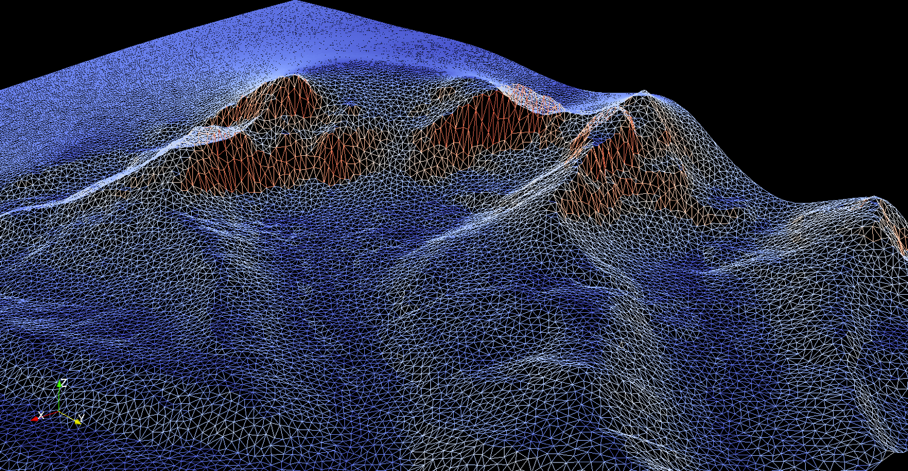

.. Canadian Hydrological Model (CHM) documentation master file, created by
   sphinx-quickstart on Thu May 28 16:00:53 2020.
   You can adapt this file completely to your liking, but it should at least
   contain the root `toctree` directive.

Welcome to Canadian Hydrological Model (CHM)'s documentation!
=============================================================

The Canadian Hydrological Model (CHM) uses a novel, modular, mesh-based
approach for developing and testing process representations in
hydrological modelling. It can move between spatial scales, temporal
scales, and spatial extents. Its key features include the abilities to
i) capture spatial heterogeneity in surface discretizations in an
efficient manner, ii) include multiple process representations; iii)
change, remove, and decouple hydrological process algorithms, iv) work
both with spatially localized (point) and non-localized (distributed)
models, v) span multiple spatial extents and scales, and vi) utilize a
variety of forcing fields for boundary and initial conditions. 

The paper describing CHM can be found `here <https://www.geosci-model-dev.net/13/225/2020/gmd-13-225-2020.html>`__.

Contributors
~~~~~~~~~~~~~
- `Chris Marsh <https://github.com/Chrismarsh>`__
- `Kevin Green <https://github.com/kevinrichardgreen/>`__
- `Nic Wayand <https://github.com/Nicwayand>`__
- `Vincent Vionnet <https://github.com/VVionnet/>`__ 
- `Wenxian Guo <https://github.com/WXGopher/>`__ 

.. toctree::
   :maxdepth: 4
   :caption: Contents:
   :hidden:

   build
   configuration
   cli
   meshgen
   forcing
   output
   visualization
   modules
   filters
   tools

   development

   api/library_root

Indices and tables
==================

* :ref:`genindex`
* :ref:`modindex`
* :ref:`search`
