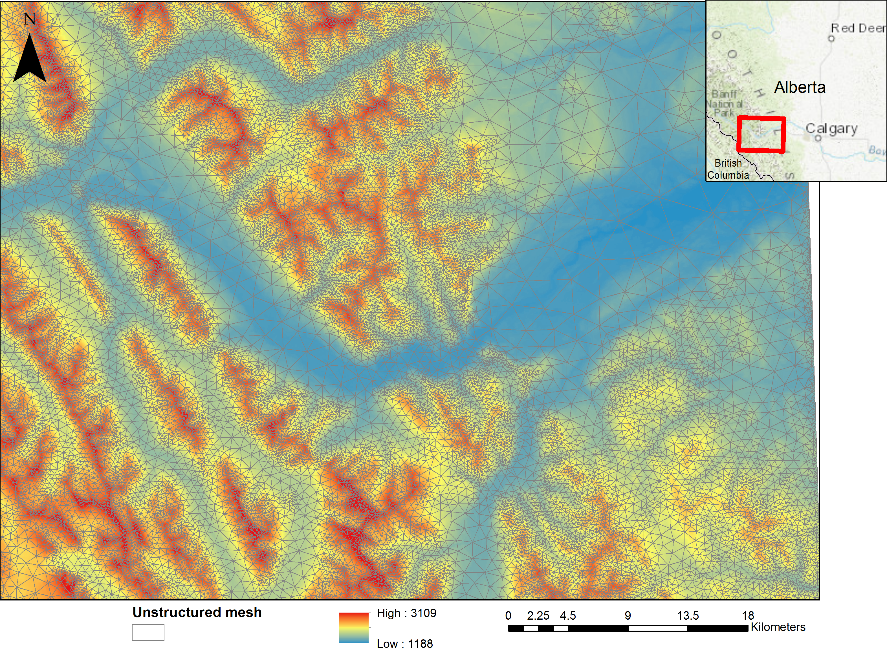

Mesh generation
=================

CHM uses a variable resolution, unstructured mesh. This mesh is generated using the `Mesher <https://mesher-hydro.readthedocs.io/en/latest/>`__ software. It needs to be installed separately from CHM. 

An example of a mesh is shown below

The output ``.mesh``, ``.param``, and ``.ic`` from mesher, as `documented here <https://mesher-hydro.readthedocs.io/en/latest/output.html>`__ are used as input, without modification, to CHM.

.. _target mesh-permutation:

Mesh permutation
-----------------
Although critical for MPI use, this feature does give ~10-15% speedup for non MPI runs and thus should almost always be done.

Because the unstructured mesh does not guarantee that triangles close in space are close in memory, mesher can permute the mesh to optimize this layout.
Details on doing so are detailed `here <https://mesher-hydro.readthedocs.io/en/latest/tools.html#mesherpermuation-py>`_.

In brief:

.. code::

   mesherpermuation.py -i meshfile.mesh

Note, this will overwrite the input file.

MPI compatibility
-------------------
In MPI mode, CHM needs to be able to only read part of the mesh on a per-MPI rank basis. Therefore a HDF5 mesh is used.
Mesher does not produce this format. However, CHM can convert from the Mesher json format to HDF5.

Conversion
++++++++++

1. Create mesh as normal with Mesher and apply the permutation
2. Convert the mesh to h5 or partitioned h5 via the :doc:`partition`.

.. warning::

   Please see the above section on mesh permutation prior to performing the hdf5 conversion.

To load the h5 files:

.. code:: json

   "meshes":
   {
      "mesh":"meshes/granger.mesh_mesh.h5",
      "parameters":
      {
         "file":"meshes/granger.mesh_param.h5,
      }
   }

To load the partitioned files:

.. code:: json

      "meshes":
      {
         "mesh": "granger1m_mesh.np2.partition"
      }

Note that no extra parameter section is needed when loading partition files.

As the partition files are computed for *n* ranks, they cannot be used with any more or fewer ranks.

.. warning::

   HDF5 and json meshes/param files **cannot** be mixed.