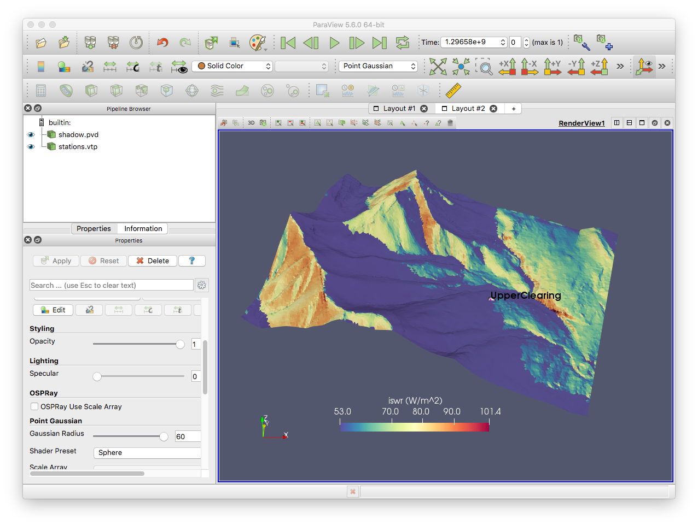
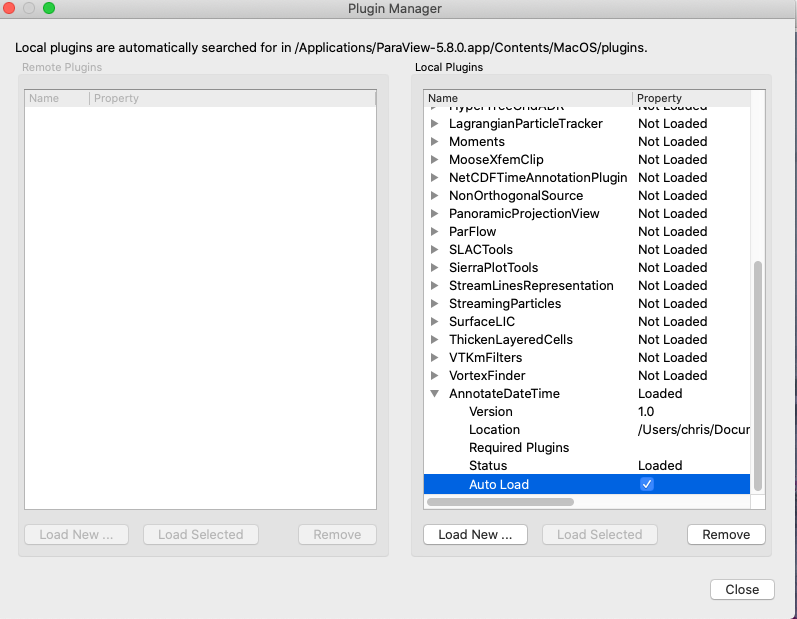
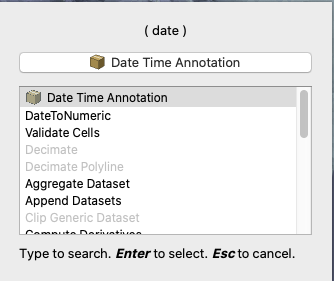

Visualization
==============

The primary vizualization of the mesh output is via `Paraview <http://www.paraview.org/>`__. This allows of efficiently viewing the spatio-temporal data.

.. note::

   If MPI is enabled, the ``pvd`` file is the only reasonable way of loading all the parts of the mesh into one view.

Paraview
********

Download Paraview from the `main web site <https://www.paraview.org/download/>`__. You do **not** need to build this from souce.

Datetime plugin
*****************

A `custom paraview
plugin <https://github.com/Chrismarsh/vtk-paraview-datetimefilter>`__ is
available to show the date and time. 

.. image:: images/datetime.gif

.. note::
   The xml plugin ``AnnotateDateTime.xml`` is all that is needed. The C++ plugin is deprecated.

To load the plugin in Paraivew:
``Tools -> Manage Plugins -> Load new -> Navigate to directory``
and choose the .xml file. If the arrow is clicked, an expanded view is shown. Selecting "auto-load" will ensure the plugin is loaded each launch.

However, the xml file needs to remain in a fixed location for this to work.

Otherwise, after restarting Paraview, you will have to reload the plugin via
``Tools -> Manage Plugins -> Load Selected``

Optionally, copy the plugin into the plugins directory of
paraview and add ``<Plugin name="AnnotateDateTime" auto_load="1"/>`` to the
``.plugins`` file. This will load the plugin automatically and not require the xml file in a seperate location.

To add the datetime plugin to the view, load the pvd file and ensure
this is selected the left pane. Then, ``Filters->Search`` and search for
``date``. Alternatively load via ``Filters->Annotation->Date Time Annotation``.

.. warning::

   This plugin only works when loading the ``pvd`` file.

Stations
*********

A ``stations.vtp`` file is written
to the root of the output folder that contains the location of each forcing station (the virtual stations). The vtp files are a point dataset of
the x,y,z value of the forcing stations, as well as the station name as
a label. (See below for output point location file). To view the points
in Paraivew:

-  Load the vtp file
-  With the vtp file selected in the Pipeline Browser, choose Point
   Gaussian as the representation. Change the radius so the point is
   visible, or decrease it if it is too large.

To view the point labels: - Select vtp file in the pipeline browser -
Create a new spreadhseet layout - Select the points you wish to have
labels displayed for - View->Selection Display Inspector - Choose Point
Labels drop down and select ‘Station name’. - Use the cog next to
‘selection colour’ to change the display font (size, colour, etc)

|image0|

Remote visualization on Graham
*******************************

A pvserver can be hosted on Compute Canada’s Graham cluster, allowing
for remote visualization without the need to copy files locally. CC
notes this is still experimental and crashes do occur. However, it seems
to generally work well. Instructions can be found
`here <https://docs.computecanada.ca/wiki/ParaView>`__. Contrary to
documentation, some users have found better performance not using
``--mesa-swr-avx2`` and some stability improvements were found too. It
is worth trying with and without this option.

For larger domains and complex multi-views, using the GPU nodes appears
to be more stable.

For datetime support, the plugin also needs to be loaded on Graham

.. warning::
   The local Paraview client version must *exactly* match the ``pvserver`` version on Graham.

.. |image0| image:: images/viz_points.png
